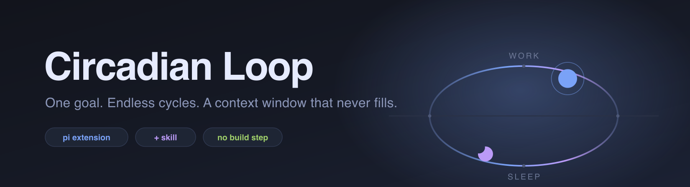
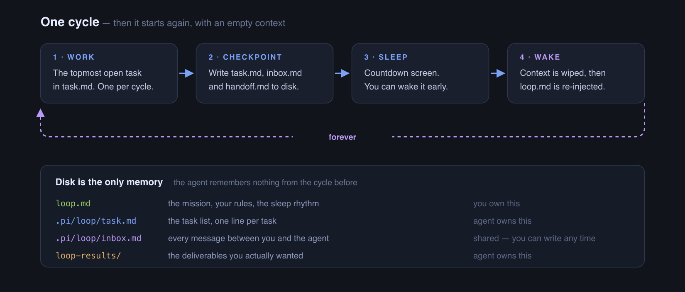

<p>
  
</p>

# Circadian Loop

**Make a [pi](https://pi.dev) agent work on one goal indefinitely. It works, saves everything to disk, sleeps, then wakes with an empty context and carries on. Forever.**

[](https://github.com/nikheal25/circadian-loop/actions/workflows/ci.yml)
[](https://github.com/earendil-works/pi-coding-agent)
[](LICENSE)

## Why this exists

**Long tasks kill agent context.** Track a job market for three months, or grind through a migration module by module, and the agent dies of context exhaustion — not because it can't do the work, but because the conversation gets too long. You come back to a compacted, confused agent repeating itself.

**Circadian Loop fixes this with disk, not context.** Each cycle: do one task → write what happened to four small files → sleep. On wake, context is **empty** and it doesn't matter — everything needed is on disk. Cycle 400 starts as clean as cycle 1.

**It never blocks on you.** Need an answer while you're asleep or at work? The question goes into an inbox file, that task waits, and the agent moves to the next one. Answer whenever — the next cycle picks it back up first.

## Install

Requires **pi v0.82+** and **Node 22+**. No cloning, no build step.

```bash
pi install git:github.com/nikheal25/circadian-loop
```

Restart pi after installing.

> Not on npm yet — `pi install npm:circadian-loop` will 404 until this is published. Use the git install above until then.

<details>
<summary>Other install methods</summary>

Into one project only (writes `.pi/settings.json` instead of your global settings):

```bash
pi install git:github.com/nikheal25/circadian-loop -l
```

Try it for a single run without installing anything:

```bash
pi -e git:github.com/nikheal25/circadian-loop
```

</details>

## Quick start

```bash
mkdir my-loop && cd my-loop
pi --approve
```

Then type:

```
set up a circadian loop
```

It asks four questions — what the goal is, any rules you want obeyed, how long to sleep between cycles — then writes `loop.md` and starts. That's the whole setup.

## How it works

<p>
  
</p>

**You steer with one file.** `loop.md` holds the mission, your rules, and the sleep rhythm. Edit it any time; the next cycle obeys. No restart.

**Nothing is hidden.** Every file is markdown you can read and edit. There is no database and no state you can't see.

## The sleep screen

```
╭──────────────────────────────────────────────────────────────────╮
│                                                                  │
│  ⠹  Circadian Loop                              waking at 03:44  │
│                                                                  │
│  ━━━━━━━━━━━━━━━━━━━━━━━━━━━━━━━━━━━━━━━━━━━━━━━━━━━━━━━━━━━━━━  │
│  5h 48m left                                                 3%  │
│                                                                  │
│  Reviewed 3 new job listings, shortlisted one at Canva and       │
│  parked a question about salary in the inbox.                    │
│                                                                  │
│ ▸ Wake now                                                       │
│   +1h                                                            │
│   −1h                                                            │
│   +15m                                                           │
│   −15m                                                           │
│   Help                                                           │
│   Stop the loop                                                  │
│                                                                  │
│  ↑↓ select · enter apply                                         │
╰──────────────────────────────────────────────────────────────────╯
```

**Help** answers "what is this thing actually doing?" — cycle number, the last cycle's note, the mission, how many tasks are open / waiting / done, what's next, whether your inbox needs you, and what the last cycle cost in time, tool calls, tokens and dollars. Problems (no `loop.md`, no tasks left, a failed compaction, an unanswered question) show under **Needs your attention**.

## Talking to it

Open `.pi/loop/inbox.md` and type a bullet under **Your message box**:

```markdown
## ✍️ Your message box
- Stop looking at contract roles, permanent only
```

The next cycle reads that before anything else and does it first. Questions the agent has for you appear in the same file under **Questions for you** — type your answer after `Your answer:` and it resumes that exact task.

## Configuration

Everything lives in `loop.md` at your project root. The sections that change behaviour:

| Section | What it controls |
|---|---|
| `## Mission` | What the loop is for. Set once at setup; edit any time. |
| `## Sleep` | Seconds between cycles, and a longer value for when every task is waiting on you. |
| `## User rules` | Constraints the agent must obey every cycle — "ask before spending money", "never post publicly". |
| `## When to stop` | A finish condition, or "never". |
| `## Task standard` | How `task.md` is maintained. |

Add your own `##` sections and they bind the agent exactly like the built-in ones.

## The `sleep` tool

The agent calls this itself at the end of a cycle. You never call it.

| Parameter | Type | Description |
|---|---|---|
| `summary` | string, required | One-line status shown on the countdown screen. Display only — the durable record is `handoff.md`. |
| `durationSeconds` | number, optional | How long to sleep. Taken from `## Sleep` in `loop.md`. Defaults to 600. |

## Evaluation data

Each cycle appends a record to `.pi/loop/cycles.jsonl`:

| Field | What it is |
|---|---|
| `cycle` | **this cycle alone** — tokens, cost, tool calls, wall-clock. Quote these. |
| `cumulative` | session-to-date totals. Not a per-cycle number. |
| `wake` | whether the boundary succeeded, tokens before → after, how much was cut |
| `user_message` | every message you typed, with a timestamp |

The file stays on your machine and is never sent anywhere. The shipped `.gitignore` excludes it — see [SECURITY.md](SECURITY.md).

## Limitations

- **The agent must cooperate.** `sleep` is a tool it chooses to call. A model that ignores the instruction in `loop.md` will not loop. Stronger models hold the protocol better.
- **A cycle is not a new session.** The boundary is a context compaction inside one pi session, so the session file grows even though the context does not. Very long-lived loops produce large session files.
- **Costs run while you're away.** That is the point, but it is real money. Use `## User rules` to constrain what the agent may spend, and check the Help screen's per-cycle cost.
- **One task per cycle by design.** If you want throughput, shorten the sleep interval rather than expecting parallel work.
- **`cycles.jsonl` grows without bound**, and the Help screen only reads the last 256 KB of it.
- **Terminal-first.** Headless modes (`--print`, `rpc`, `json`) sleep correctly, but the countdown screen and Help are TUI only.

## Docs

[Contributing](CONTRIBUTING.md) · [Changelog](CHANGELOG.md) · [Security](SECURITY.md) · [Roadmap](TODO.md)

## License

MIT — see [LICENSE](LICENSE).
