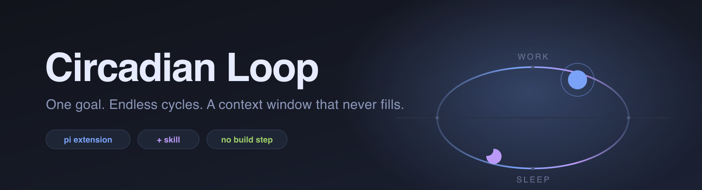
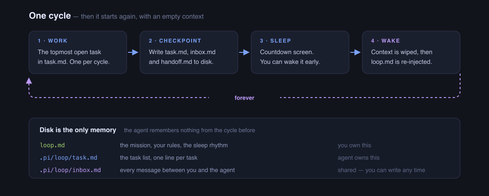

<p>
  
</p>

# Circadian Loop

**Make a [pi](https://pi.dev) agent work on one goal indefinitely. It works, saves everything to disk, sleeps, then wakes with an empty context and carries on. Forever.**

[](https://www.npmjs.com/package/circadian-loop)
[](https://github.com/nikheal25/circadian-loop/actions/workflows/ci.yml)
[](https://github.com/earendil-works/pi-coding-agent)
[](LICENSE)

## Why this exists

**An agent's memory is its conversation — and conversations run out.** Any job that takes days rather than minutes will fill the context window long before the work is done. The agent gets compacted, loses the thread, and starts redoing what it already finished. So you sit there babysitting it, or you never hand it the long job at all.

**Circadian Loop moves the memory off the conversation and onto disk.** One cycle is: do a single task → write down what happened → sleep. When it wakes, the context is **empty**, and that no longer matters — the mission, the task list, your messages and the last cycle's note are all files it reads back on the way in. Cycle 400 starts as clean as cycle 1.

**So you can give it work that outlives a conversation.** *"Patch this repo's dependencies — one safe upgrade per cycle, smallest change that works"* and it is still going in week twelve. *"Every morning, check the production API's uptime, error rate and latency, and log an incident the moment one crosses the line"* and the log keeps filling while you sleep.

**And it never blocks on you.** Need an answer while you're asleep or at work? The question goes into an inbox file, that one task waits, and the agent moves on to the next. Answer whenever — the next cycle picks that exact task back up first.

## Install

Requires **pi v0.82+** and **Node 22+**. No cloning, no build step.

```bash
pi install npm:circadian-loop
```

Restart pi after installing.

<details>
<summary>Other install methods</summary>

Straight from git instead of npm:

```bash
pi install git:github.com/nikheal25/circadian-loop
```

Into one project only (writes `.pi/settings.json` instead of your global settings):

```bash
pi install npm:circadian-loop -l
```

Try it for a single run without installing anything:

```bash
pi -e npm:circadian-loop
```

</details>

## Quick start

```bash
mkdir my-loop && cd my-loop
pi --approve
```

Then run the skill:

```
/skill:circadian-loop
```

That one command is the whole interface, and it does both jobs:

- **No `loop.md` yet?** It interviews you — what the goal is, what rules you want obeyed, how long to sleep between cycles — then writes `loop.md` and the loop's files and starts. That's the entire setup.
- **`loop.md` already there?** It reads it and picks the loop back up. This is also how you restart a loop after quitting pi.

You can also just say it in plain words — "set up a circadian loop", or "follow loop.md" — and the agent will usually load the skill by itself. `/skill:circadian-loop` is the version that always works.

## How it works

<p>
  
</p>

**You steer with one file.** `loop.md` holds the mission, your rules, and the sleep rhythm. Edit it any time; the next cycle obeys. No restart.

**Nothing is hidden.** Every file is markdown you can read and edit. There is no database and no state you can't see.

## The sleep screen

```
╭──────────────────────────────────────────────────────────────────╮
│                                                                  │
│  ⠹  Circadian Loop                              waking at 03:40  │
│                                                                  │
│  ━━━━━━━━━━━━━━━━━━━━━━━━━━━━━━━━━━━━━━━━━━━━━━━━━━━━━━━━━━━━━━  │
│  5h 48m left                                                 3%  │
│                                                                  │
│  Reviewed 3 new job listings, shortlisted one at Canva and       │
│  parked a question about salary in the inbox.                    │
│                                                                  │
│  ▸ Wake now                                                      │
│    +1h                                                           │
│    −1h                                                           │
│    +15m                                                          │
│    −15m                                                          │
│    Help                                                          │
│    Stop the loop                                                 │
│                                                                  │
│  ↑↓ select · enter apply                                         │
╰──────────────────────────────────────────────────────────────────╯
```

**Help** answers "what is this thing actually doing?" — cycle number, the last cycle's note, the mission, how many tasks are open / waiting / done, what's next, whether your inbox needs you, and what the last cycle cost in time, tool calls, tokens and dollars. Problems (a missing loop file, no tasks left, a failed compaction, an unanswered question) show under **Needs your attention**.

## Talking to it

Open `.pi/loop/inbox.md` and type a bullet under **Your message box**:

```markdown
## ✍️ Your message box
- Stop looking at contract roles, permanent only
```

The next cycle reads that before anything else and does it first. Questions the agent has for you appear in the same file under **Questions for you** — type your answer after `Your answer:` and it resumes that exact task.

## Configuration

Everything lives in `loop.md` at your project root. Every `##` section in it binds the agent; these are the ones you'll actually want to edit:

| Section | What it controls |
|---|---|
| `## Mission` | What the loop is for. Set once at setup; edit any time. |
| `## Sleep` | Seconds between cycles, and a longer value for when every task is waiting on you. |
| `## User rules` | Constraints the agent must obey every cycle — "ask before spending money", "never post publicly". |
| `## When to stop` | A finish condition, or "never". |
| `## Task standard` | How `.pi/loop/task.md` is maintained. |

Add your own `##` sections and they bind the agent exactly like the built-in ones.

## The `sleep` tool

The agent calls this itself at the end of a cycle. You never call it.

| Parameter | Type | Description |
|---|---|---|
| `summary` | string, required | One-line status shown on the countdown screen. Display only — the durable record is `handoff.md`. |
| `durationSeconds` | number, optional | How long to sleep. Taken from `## Sleep` in `loop.md`. Defaults to 600. |

## Evaluation data

When launched with `CIRCADIAN_DEBUG=1` (off by default), the extension appends a line to `.pi/loop/cycles.jsonl` at every boundary. Each line carries an `event` field saying which kind it is:

| `event` | What that line records |
|---|---|
| `sleep` | The end of a cycle. Its `cycle` key is **that cycle alone** — tokens, cost, tool calls, wall-clock. Quote these. Its `cumulative` key is session-to-date totals, which are not per-cycle numbers. |
| `wake` | The boundary itself: whether the compaction succeeded, tokens before → after, and how much was cut. |
| `user_message` | Every message you typed, with a timestamp. |
| `unplanned_compaction` · `wake_failed` · `stopped` · `aborted` | Everything that went sideways, so a loop that died leaves a reason behind. |

The file stays on your machine and is never sent anywhere. It records everything you type, so add `.pi/loop/` to your project's `.gitignore` before you commit — see [SECURITY.md](SECURITY.md).

## Limitations

- **The agent must cooperate.** `sleep` is a tool it chooses to call. A model that ignores the instruction in `loop.md` will not loop. Stronger models hold the protocol better.
- **A cycle is not a new session.** The boundary is a context compaction inside one pi session, so the session file grows even though the context does not. Very long-lived loops produce large session files.
- **Costs run while you're away.** That is the point, but it is real money. Use `## User rules` to constrain what the agent may spend, and check the Help screen's per-cycle cost.
- **One task per cycle by design.** If you want throughput, shorten the sleep interval rather than expecting parallel work.
- **`cycles.jsonl` grows without bound**, and the Help screen only reads the last 256 KB of it.
- **Terminal-first.** Headless modes (`--print`, `rpc`, `json`) sleep correctly, but the countdown screen and Help are TUI only.

## Docs

[Architecture](https://github.com/nikheal25/circadian-loop/blob/main/docs/architecture.md) · [Troubleshooting](https://github.com/nikheal25/circadian-loop/blob/main/docs/troubleshooting.md) · [Contributing](https://github.com/nikheal25/circadian-loop/blob/main/CONTRIBUTING.md) · [Changelog](CHANGELOG.md) · [Security](SECURITY.md) · [Roadmap](https://github.com/nikheal25/circadian-loop/blob/main/TODO.md)

## License

MIT — see [LICENSE](LICENSE).
